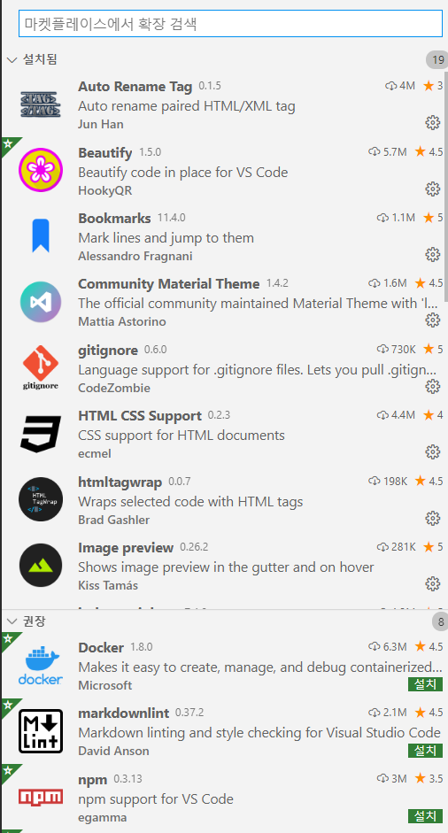
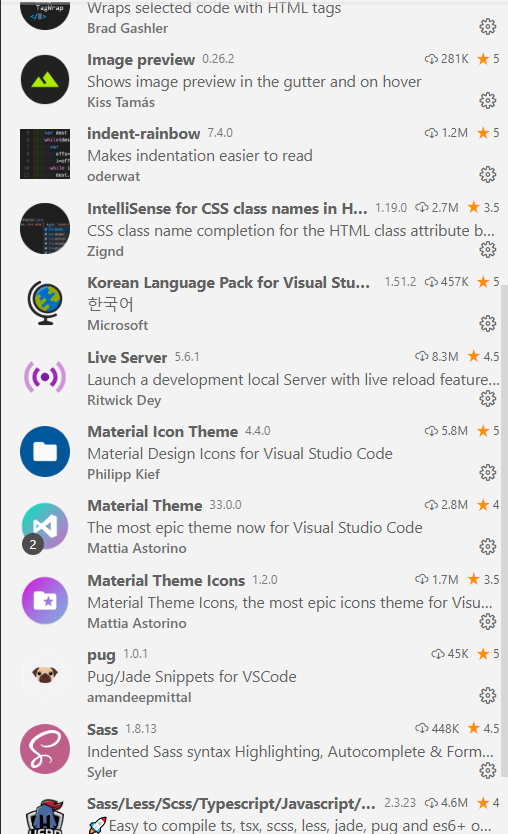
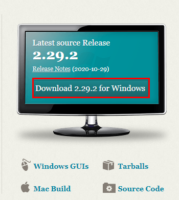
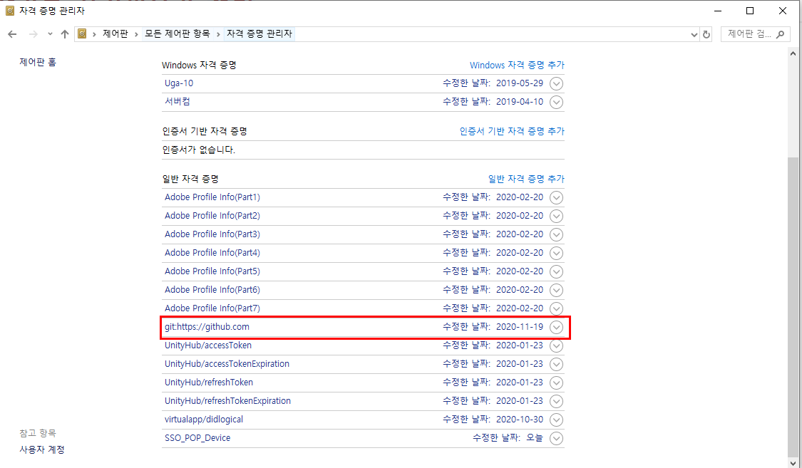

# vscode 확장기능 사진찍은거 설치




# git설치
[git-scm.com](https://git-scm.com)

## vscode에서 최초에 깃을 접근하면 로그인창이 뜬다. 여기서 로그인 하고나면

위 그림의 자격증명관리자가 생긴다.

# git-scm - git config --global user.name 'booldook'
# git-scm - git config --global user.email 'booldook@gmail.com'

# Nodejs설치
[노드설치파일](https://nodejs.org)
- 브라우저 밖에서 javascript를 사용할 수 있다.
- npm 명령이 설치된다.
## node의 global 설치 모듈
- nodemon
- firebase-tools
```bash
npm i -g nodemon
npm i -g firebase-tools
npm i -g express-generator
npm i -g @vue/cli
npm i -g react-create-dom
```

# bitnami
- window -> wamp, mac -> mamp, linux -> lamp
- apache, mysql, php 
- 설치할 프로그램에서 phpmyadmin 빼고 다 해제. 비밀번호 000000


# heidisql

